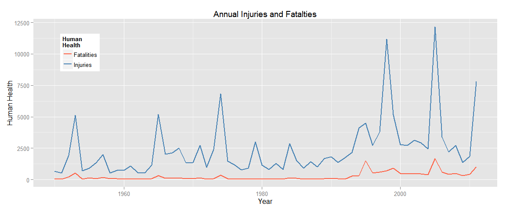
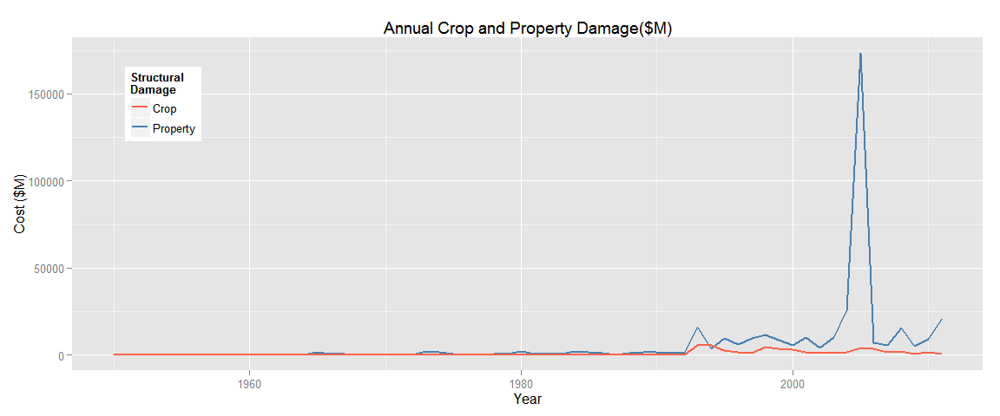

# NOAA Storm Damage Analysis
Lisa Faiss  
Monday, May 28, 2015  
### SYNOPSIS

This report describes the economic and human health impacts from weather events for all US states and its territories between 1955 and 2011, providing government officials insights for effectively appropriating emergency response funds and policy adoption. This report demonstrates when and where catastrophic events occur is unpredictable, suggesting that national funding to supplement local emergency response funding is prudent. Some of these deleterious effects may be lessened with proper preventative measures. Tornadoes cause the most fatalities, yet this can be minimized by providing early warning systems to alert residents of their need to seek shelter. Heat waves also cause many deaths and could be minimized through outreach programs aimed at the elderly poor to ensure they have safe shelter. Property damage is most effected by rainstorms, followed by hurricanes and tornadoes. Preventative measures such as stricter weather-tolerant building codes could reduce losses. Relief funding to farmers may be the most practical response for crop destruction, given crops are most susceptible to damage from unpreventable heat waves and flooding. These data also uncover inconsistencies in weather event recording, suggesting a need for more accurate, standardized reporting. 

### DATA PROCESSING

Load packages only as needed. Then extract the NOAA Weather data from an archived Cloudfront server. Indicate that the data items should be treated as character, rather than factors. 


```r
# Install function for packages    
packages<-function(x){
    x<-as.character(match.call()[[2]])
    if (!require(x,character.only=TRUE)){
        install.packages(pkgs=x,repos="http://cran.rstudio.com")
        require(x,character.only=TRUE)
    }
}
packages(ggplot2); packages(dplyr); packages(xtable); packages(knitr); packages(stringr)
```


```r
options(scipen=999)  ## supress exponential notation for numerics in the Markdown file
options(width = 100)
```


```r
# Read in the weather data

download_url<-"http://d396qusza40orc.cloudfront.net/repdata%2Fdata%2FStormData.csv.bz2"
download.file(download_url, destfile="rawStorm.csv.bz2")

rawStormData <- read.csv("rawStorm.csv.bz2", stringsAsFactors = FALSE, sep="," )

rawStormCt = length(rawStormData$EVTYPE) 
```

#### Cleansing Data
Initial processing was performed on these data to delete rows whose event type, "EVTYPE", contain any type that's either already accounted for (Summary) or is not attributable to a storm type (?,None,etc.). The date was converted to the Date class, and the time was stripped, since all were set to "00:00:00".


```r
## Subset the data. 

uniqueRawEvents <- unique(rawStormData$EVTYPE)

# Grab the columns that allow analysis of event injuries, fatalities, and property/crop damage or provide 
# context, such as date and state. Delete rows containing events that are either already accounted for 
# (summaries) or mischaracterized or unattributable to a storm type.

discardEvents = "Summary|\\?|NONE|RECORD|URBAN AND SMALL|APACHE COUNTY|PATTERN|Other|MONTHLY|URBAN/SMALL|URBAN SMALL|No Severe"
stormData = rawStormData[!grepl(discardEvents, rawStormData$EVTYPE, ignore.case = TRUE), 
                         c("EVTYPE", "BGN_DATE", "STATE", "INJURIES", "FATALITIES", 
                           "CROPDMG", "CROPDMGEXP", "PROPDMG", "PROPDMGEXP")]
names(stormData) = c("EVENT", "DATE", "STATE", "INJURY", "FATAL", "CROP_COST", "CROPEXP", "PROPERTY_COST", "PROPEXP")
stormData$DATE = as.Date(stormData$DATE, "%m/%d/%Y")

# Get the number of records in the cleaned data set
stormCt = length(stormData$EVENT)
```

In total, 902,297 records were read from the raw data file. Only 0.0792% of these data were deleted, leaving 901,582 records to examine.

Because the property and crop damage costs have inconsistent units, the data were converted to a standard unit of dollars in millions (M). If a unit other than K (thousands), M (millions), or B (billions) is used, the dollar amount will be set to 0 and not used in the summarized data.


```r
standardizeCost <- function(x,w) {
                        if(w == "B" | w == "b") { x = 1000 * x
                        } else if(w == "M" | w == "m") { x = 1 * x
                        } else if(w == "K" | w == "k") { x = .001 * x
                        } else x = 0 }

stormData$CROP_COST <- unlist(Map(standardizeCost, stormData$CROP_COST, stormData$CROPEXP))

stormData$PROPERTY_COST <- unlist(Map(standardizeCost, stormData$PROPERTY_COST, stormData$PROPEXP))
```

#### Examination of Outliers

Examining the summaries for injuries, fatalities, and property and crop damage it's apparent that the data is right-skewed and extreme outliers will have more influence on summarized values. 


```r
summary(stormData$INJURY); summary(stormData$FATAL); summary(stormData$PROPERTY_COST);summary(stormData$CROP_COST)
```

```
##      Min.   1st Qu.    Median      Mean   3rd Qu.      Max. 
##    0.0000    0.0000    0.0000    0.1558    0.0000 1700.0000
```

```
##     Min.  1st Qu.   Median     Mean  3rd Qu.     Max. 
##   0.0000   0.0000   0.0000   0.0168   0.0000 583.0000
```

```
##      Min.   1st Qu.    Median      Mean   3rd Qu.      Max. 
##      0.00      0.00      0.00      0.47      0.00 115000.00
```

```
##     Min.  1st Qu.   Median     Mean  3rd Qu.     Max. 
##    0.000    0.000    0.000    0.054    0.000 5000.000
```

The records corresponding to the maximum storm injuries, fatalities, property damage, and crop damage are shown. The date, state, and location are supplied for context. Internet searches were performed to determine the nature of the event that transpired. 

**MOST INJURIES**

The event that resulted in the most injuries, and a fair amount of fatalities, are associated with a tornado that struck Wichita, Texas in 1979. [1]


```r
# Check to see maximum damage after standardizing cost exponents
stormData[which.max(stormData$INJURY),]
```

```
##          EVENT       DATE STATE INJURY FATAL CROP_COST CROPEXP PROPERTY_COST PROPEXP
## 157885 TORNADO 1979-04-10    TX   1700    42         0                   250       M
```

**MOST FATALITIES**

The event that first emerges as the weather event with the most fatilities appears to be the Chicago heat wave of 1995 which claimed numerous lives. It inordinately affected the elderly poor, since they lacked air conditioning and kept their windows and doors shut as a result of living in poor neighborhoods. The extreme temperatures led to social unrest as some neighborhoods vandalized fire hydrants, which in turn led to water pressure loss in nearby homes already experiencing power loss. This is a lesson in why government agencies must be proactive regarding predicted adverse weather conditions. [2] Later, we'll see that this event surfaced due to under-reporting of another event. 


```r
# Check to see maximum damage after standardizing cost exponents
stormData[which.max(stormData$FATAL),]
```

```
##        EVENT       DATE STATE INJURY FATAL CROP_COST CROPEXP PROPERTY_COST PROPEXP
## 198704  HEAT 1995-07-12    IL      0   583         0                     0
```

**GREATEST CROP LOSSES**

The Great Flood of 1993 caused the largest crop damage in Illinois, affecting nearby St. Louis as well and shutting down major thoroughfares for weeks. The flood was record-setting in duration, lasting 144 days above flood stage levels. It was the most costly flood in US modern history. Note that fatalities are not reported for this event, though 47 people were reported to have lost their lives by the USGS. [3]


```r
# Check to see maximum damage after standardizing cost exponents
stormData[which.max(stormData$CROP_COST),]
```

```
##              EVENT       DATE STATE INJURY FATAL CROP_COST CROPEXP PROPERTY_COST PROPEXP
## 198389 RIVER FLOOD 1993-08-31    IL      0     0      5000       B          5000       B
```

**GREATEST PROPERTY DAMAGE**

Surprisingly, these data indicate the single event with the greatest property damage was due to California flooding in January of 2006, which resulted in Federal disaster declarations in ten counties. The USGS declared damages at $300 million, which is magnitudes lower than reported in these data. [4]


```r
# Check to see maximum damage after standardizing cost exponents
stormData[which.max(stormData$PROPERTY_COST),] 
```

```
##        EVENT       DATE STATE INJURY FATAL CROP_COST CROPEXP PROPERTY_COST PROPEXP
## 605953 FLOOD 2006-01-01    CA      0     0      32.5       M        115000       B
```

Resetting the value of the California storm to that reported by the USGS estimate of $300M reveals that Hurricane Katrina caused the greatest property damage, $31B.  


```r
# Set the property damage to that calculated by the USGS estimate
stormData$PROPERTY_COST[which.max(stormData$PROPERTY_COST)] = 300  # Adjust to value reported by USGS
propIndex = which.max(stormData$PROPERTY_COST)
stormData[propIndex,]
```

```
##              EVENT       DATE STATE INJURY FATAL CROP_COST CROPEXP PROPERTY_COST PROPEXP
## 577676 STORM SURGE 2005-08-29    LA      0     0         0                 31300       B
```

Looking at these data, the reporting once again seems suspect, given no fatalities are reported. According to a report by the National Hurricane Center, Katrina's actual fatalities were 1,200 people with overall damage of $108B.[5] 

It's entry was thus corrected to reflect this new information. Injuries could not be located, so it was set to the ratio of injuries/fatalities seen in the overall data (calculated from means).


```r
stormData$PROPERTY_COST[propIndex] = 108000  # $108B in millions
stormData$FATAL[propIndex] = 1200
stormData$INJURY[propIndex] = round(stormData$FATAL[propIndex] * mean(stormData$INJURY)/mean(stormData$FATAL))
stormData$INJURY[propIndex]
```

```
## [1] 10332
```

#### Data Anomalies 

Analyzing these data reveal the need for agencies to standardize event categorization and ensure accurate reporting of human health and economic impacts. Outlier weather events such as Hurricane Katrina particularly highlight these data conflict with reporting done by other agencies; these data reported no fatalities or injuries though it was the deadliest and costliest storm event to date. Many agencies may lack the training necessary to ensure accurate reporting. Damage costs can be magnitudes off if innacurate exponents are entered. 

Because these data were produced using NOAA's *Storm Data* software, it could be modified to only allow standard event selections, with an addendum field for further detail. Additionally, following data entry, a human readable summary could be displayed for the operator to confirm before finalizing data entry. [6]

### RESULTS

#### Examining All U.S. Storm Damage
The summaries  below show the mean, the middle 50% of values, and overall spread for property damage, crop damage, injuries, and fatalities. 

These data reveal extremely right-skewed distributions for weather-related injuries, fatalities, and crop/property damage. The means are near zero, along with 50% of storm events. The maximum values indicate outlier storm events that contribute inordinate influence on overall summary outcomes of these measures. 


```r
summary(stormData$INJURY); summary(stormData$FATAL)
```

```
##      Min.   1st Qu.    Median      Mean   3rd Qu.      Max. 
##     0.000     0.000     0.000     0.167     0.000 10330.000
```

```
##      Min.   1st Qu.    Median      Mean   3rd Qu.      Max. 
##    0.0000    0.0000    0.0000    0.0181    0.0000 1200.0000
```

```r
summary(stormData$PROPERTY_COST); summary(stormData$CROP_COST)
```

```
##      Min.   1st Qu.    Median      Mean   3rd Qu.      Max. 
##      0.00      0.00      0.00      0.43      0.00 108000.00
```

```
##     Min.  1st Qu.   Median     Mean  3rd Qu.     Max. 
##    0.000    0.000    0.000    0.054    0.000 5000.000
```


#### Consolidate Events
Examining the event type, it is obvious event naming is not standardized (see Appendix), with 985 unique names. These data event types were mapped to standardized naming to summarize damages from like events more easily. The eventChk variable used in the code chunk below indicates the mapping that was used. It is an array of paired data: the first pair element indicates the EVENT type's string pattern to be searched while the second specifies the replacement name. 


```r
## EVENT CONVERSION PAIRS: Search string and aggregate event name
eventChk = list(c("TORNADO|FUNNEL|WALLCLOUD|WALL CLOUD|TORNDAO|SPOUT", "TORNADO"),
                c("FLO*OD|FLD|STREAM|DROWNING|DAM", "FLOOD"),
                c("FIRE|RED FLAG|SMOKE","FIRE"), 
                c("VOLCAN|VOG","VOLCANO"),
                c("SNOW|BLIZZ|WINT|LOW|ICY|ICE|COLD|FROST|FREEZ|GLAZE|^AVA|HYPO|HEAVY MIX|COOL|SLEET", 
                  "SNOW/ICE"),
                c("TIDE|MARINE|RIP|CURRENT|BEACH|SURF|SEA|COAST|SWELL|WATER|RISING|SEICHE|WAVE|TSU", 
                  "TIDE/OCEAN"), 
                c("WIND|WND|DUST|GUSTNADO|BLOW|TURBULENCE|SOUTHEAST", "WIND"),
                c("THUNDER|MICROBURST|TSTM|RAIN|WET|DOWNBURST|PRECIP|LIGHT|LIGN|SHOWER|STORM", 
                  "RAINSTORM"),
                c("HURRICANE|SURGE|TROPICAL|TYPHOON|FLOYD","HURRICANE"), 
                c("HAIL","HAIL"),
                c("HEAT|HIGH|EXCESSIVE|WARM|DRY|DRIEST|DROUGHT|HOT|HYPER", "HEAT"),
                c("SLIDE|LANDSLUMP","LANDSLIDE"),
                c("FOG","FOG"))

# Function that allows renaming of matched strings to a "group" name, based on a mapping pair. 
# The first part of the pair is a regular expression pattern to search for. If the pattern is 
# matched, it is replaced by second element of the pair, the "group" name.
groupRename <- function(x, convPair){
    for(i in 1:length(x)){
        for(pair in 1:length(convPair)){
            if(grepl(convPair[[pair]][1],x[i], ignore.case = TRUE)) {
                x[i] = convPair[[pair]][2]
                break
            }
        }
    }
    return (x)
}

# Name similar events with same event name so that they can be grouped together for summarization. 
stormData$EVENT = groupRename(stormData$EVENT, eventChk)
```

The events were mapped to one in the following set: 
TORNADO, WIND, HAIL, SNOW/ICE, FLOOD, HURRICANE, RAINSTORM, FOG, TIDE/OCEAN, HEAT, FIRE, LANDSLIDE, VOLCANO.

Analysis of the data was performed by YEAR and by EVENT. Both analyses summarized the weather events data by total number of injuries, fatalities, property loss, and crop damage. The EVENT analysis created a table grouping the data by weather event ordered by descending fatalites and another by descending property damage. The YEAR analysis created summarized data grouped by year. 

#### Summarized Weather Analysis by EVENT


```r
# Group the data by event type and summarize injuries, fatalities, and property/crop damage
stormSummary <- stormData %>%         
    group_by(EVENT) %>%
        summarise_each(funs(sum), INJURY, FATAL, PROPERTY_COST, CROP_COST) %>%
        arrange(desc(FATAL))

eventStatistics<-summary(stormSummary)
stormSummary
```

```
## Source: local data frame [13 x 5]
## 
##         EVENT INJURY FATAL PROPERTY_COST  CROP_COST
## 1     TORNADO  91439  5664    58602.8695   417.4614
## 2        HEAT   8787  2939     1055.7717 14871.4353
## 3   RAINSTORM  16358  2202   133341.1487  1661.9159
## 4       FLOOD   8690  1553    52898.3549 12684.8822
## 5    SNOW/ICE   6869  1339    12641.8877  8438.8779
## 6        WIND  11799  1179    15945.4064  2034.3010
## 7  TIDE/OCEAN   1423  1078     4932.6613    18.0300
## 8   HURRICANE   1331   133    85258.0720  5506.1178
## 9        FIRE   1608    90     8501.7285   403.2816
## 10        FOG   1076    80       22.8295     0.0000
## 11  LANDSLIDE     55    44      327.3961    20.0170
## 12       HAIL   1371    15    15732.8887  3046.8374
## 13    VOLCANO      0     0        0.5000     0.0000
```


```r
dplyr::arrange(stormSummary,desc(PROPERTY_COST))
```

```
## Source: local data frame [13 x 5]
## 
##         EVENT INJURY FATAL PROPERTY_COST  CROP_COST
## 1   RAINSTORM  16358  2202   133341.1487  1661.9159
## 2   HURRICANE   1331   133    85258.0720  5506.1178
## 3     TORNADO  91439  5664    58602.8695   417.4614
## 4       FLOOD   8690  1553    52898.3549 12684.8822
## 5        WIND  11799  1179    15945.4064  2034.3010
## 6        HAIL   1371    15    15732.8887  3046.8374
## 7    SNOW/ICE   6869  1339    12641.8877  8438.8779
## 8        FIRE   1608    90     8501.7285   403.2816
## 9  TIDE/OCEAN   1423  1078     4932.6613    18.0300
## 10       HEAT   8787  2939     1055.7717 14871.4353
## 11  LANDSLIDE     55    44      327.3961    20.0170
## 12        FOG   1076    80       22.8295     0.0000
## 13    VOLCANO      0     0        0.5000     0.0000
```

These tables reveal interesting details:

+ Tornadoes cause the most fatalities and injuries, with a fair amount of property damage as well. 

+ Heat waves produce a large number of fatalities with relatively lower injuries and very little property damage.

+ Heat waves and flooding cause the greatest crop losses. 

+ Surprisingly, rainstorms cause the greatest property damage and a fair amount of fatalities and injuries. Though a single rainstorm is less destructive than a tornado or hurricane, they are far more common and thus cummulatively cause more damage (though tornados are more deadly). 

+ Hurricanes have relatively low fatalities and injuries relative to destruction of property. This may be due to how effective early warning and preparation is in reducing fatalities and injuries; government coordinated warning and evacuation plans appear to have minimized their impact on human health. 

#### Summarized Weather Analysis by YEAR


```r
# Group the data by year and summarize annual injuries, fatalities, and property/crop damage
stormSummary <- stormData %>%         
    transform(YEAR = as.numeric(format(DATE,"%Y"))) %>%
    group_by(YEAR) %>%
        summarise_each(funs(sum), INJURY, FATAL, PROPERTY_COST, CROP_COST)

annualStatistics<-summary(stormSummary)
```

These plots illustrate weather conditions over time. Note the bump in the mid 1990s in all reported health and economic impacts. This is most likely due to new requirements for reporting these measurements for accurate tracking of weather conditions impacts. 


```r
g = ggplot(data = stormSummary, aes(x = YEAR)) + ylab("Human Health") + xlab("Year")
g = g + geom_line(aes(y = INJURY, colour = "Injuries"), size=1)
g = g + geom_line(aes(y = FATAL, colour = "Fatalities"), size=1)
g = g + ggtitle("Annual Injuries and Fatalties")
g = g + theme(legend.position=c(.1, .8))              # fix legend position
g = g + scale_colour_manual(name = "Human\nHealth", values=c("tomato","steelblue"))  # fix legend name

h = ggplot(data = stormSummary, aes(x = YEAR)) + ylab("Cost ($M)") + xlab("Year")
h = h + geom_line(aes(y = PROPERTY_COST, colour = "Property"), size=1)
h = h + geom_line(aes(y = CROP_COST, colour = "Crop"), size=1)
h = h + ggtitle("Annual Crop and Property Damage($M)")
h = h + theme(legend.position=c(.1, .8))      # fix legend position
h = h + scale_colour_manual(name = "Structural\nDamage", values=c("tomato","steelblue"))  # fix legend name
g;h
```

  

Reviewing this chart, one might conclude that storms have become more extreme after the mid 1990s. It is difficult to fathom that there was very little property and crop damage or so few injuries and fatalities prior to this period. It is unknown if agencies prior to this time actually reported this information. In addition, the provided data makes no mention of whether or not the dollar values have been adjusted for inflation. 

Examining the fatalities and injuries demonstrates weather impacts vary greatly over time. Drilling down into the most extreme events for all damage categories reveals that catastrophic weather can occur almost anywhere at any time. 

## References
[1] "1979 Red River Valley Tornado Outbreak", Wikipedia, http://en.wikipedia.org/wiki/1979_Red_River_Valley_tornado_outbreak

[2] "Dying Alone", University of Chicago Press, http://press.uchicago.edu/Misc/Chicago/443213in.html

[3] "Flood of 1993", USGS, http://mo.water.usgs.gov/fact_sheets/fs-188-95-southard/report.pdf

[4] "Storms and Flooding in California in December 2005 and January 2006", USGS, http://pubs.usgs.gov/of/2006/1182/

[5] "NOAA Technical Memorandum NWS NHC-6", Tables 2 & 3A, National Hurricane Center, http://www.nhc.noaa.gov/pdf/nws-nhc-6.pdf

[6] "National Weather Service Instruction 10-1605", page 4, National Weather Service, "https://d396qusza40orc.cloudfront.net/repdata%2Fpeer2_doc%2Fpd01016005curr.pdf"


## APPENDIX:

### Processed Storm Data 


```r
str(stormData)   
```

```
## 'data.frame':	901582 obs. of  9 variables:
##  $ EVENT        : chr  "TORNADO" "TORNADO" "TORNADO" "TORNADO" ...
##  $ DATE         : Date, format: "1950-04-18" "1950-04-18" "1951-02-20" ...
##  $ STATE        : chr  "AL" "AL" "AL" "AL" ...
##  $ INJURY       : num  15 0 2 2 2 6 1 0 14 0 ...
##  $ FATAL        : num  0 0 0 0 0 0 0 0 1 0 ...
##  $ CROP_COST    : num  0 0 0 0 0 0 0 0 0 0 ...
##  $ CROPEXP      : chr  "" "" "" "" ...
##  $ PROPERTY_COST: num  0.025 0.0025 0.025 0.0025 0.0025 0.0025 0.0025 0.0025 0.025 0.025 ...
##  $ PROPEXP      : chr  "K" "K" "K" "K" ...
```

```r
summary(stormData)
```

```
##     EVENT                DATE               STATE               INJURY              FATAL          
##  Length:901582      Min.   :1950-01-03   Length:901582      Min.   :    0.000   Min.   :   0.0000  
##  Class :character   1st Qu.:1995-04-19   Class :character   1st Qu.:    0.000   1st Qu.:   0.0000  
##  Mode  :character   Median :2002-03-23   Mode  :character   Median :    0.000   Median :   0.0000  
##                     Mean   :1998-12-28                      Mean   :    0.167   Mean   :   0.0181  
##                     3rd Qu.:2007-07-29                      3rd Qu.:    0.000   3rd Qu.:   0.0000  
##                     Max.   :2011-11-30                      Max.   :10332.000   Max.   :1200.0000  
##    CROP_COST          CROPEXP          PROPERTY_COST         PROPEXP         
##  Min.   :   0.000   Length:901582      Min.   :     0.00   Length:901582     
##  1st Qu.:   0.000   Class :character   1st Qu.:     0.00   Class :character  
##  Median :   0.000   Mode  :character   Median :     0.00   Mode  :character  
##  Mean   :   0.054                      Mean   :     0.43                     
##  3rd Qu.:   0.000                      3rd Qu.:     0.00                     
##  Max.   :5000.000                      Max.   :108000.00
```

```r
head(stormData, n = 15)
```

```
##      EVENT       DATE STATE INJURY FATAL CROP_COST CROPEXP PROPERTY_COST PROPEXP
## 1  TORNADO 1950-04-18    AL     15     0         0                0.0250       K
## 2  TORNADO 1950-04-18    AL      0     0         0                0.0025       K
## 3  TORNADO 1951-02-20    AL      2     0         0                0.0250       K
## 4  TORNADO 1951-06-08    AL      2     0         0                0.0025       K
## 5  TORNADO 1951-11-15    AL      2     0         0                0.0025       K
## 6  TORNADO 1951-11-15    AL      6     0         0                0.0025       K
## 7  TORNADO 1951-11-16    AL      1     0         0                0.0025       K
## 8  TORNADO 1952-01-22    AL      0     0         0                0.0025       K
## 9  TORNADO 1952-02-13    AL     14     1         0                0.0250       K
## 10 TORNADO 1952-02-13    AL      0     0         0                0.0250       K
## 11 TORNADO 1952-02-13    AL      3     0         0                2.5000       M
## 12 TORNADO 1952-02-13    AL      3     0         0                2.5000       M
## 13 TORNADO 1952-02-13    AL     26     1         0                0.2500       K
## 14 TORNADO 1952-02-29    AL     12     0         0                0.0000       K
## 15 TORNADO 1952-03-03    AL      6     0         0                0.0250       K
```

```r
tail(stormData, n = 15)   
```

```
##           EVENT       DATE STATE INJURY FATAL CROP_COST CROPEXP PROPERTY_COST PROPEXP
## 902283 SNOW/ICE 2011-11-05    AK      0     0         0       K             0       K
## 902284     WIND 2011-11-12    CO      0     0         0       K             0       K
## 902285 SNOW/ICE 2011-11-19    MI      0     0         0       K             0       K
## 902286     WIND 2011-11-16    WA      0     0         0       K             0       K
## 902287     HEAT 2011-11-01    OK      0     0         0       K             0       K
## 902288 SNOW/ICE 2011-11-05    CO      0     0         0       K             0       K
## 902289 SNOW/ICE 2011-11-28    TX      0     0         0       K             0       K
## 902290     WIND 2011-11-12    CO      0     0         0       K             0       K
## 902291 SNOW/ICE 2011-11-28    MS      0     0         0       K             0       K
## 902292 SNOW/ICE 2011-11-28    TN      0     0         0       K             0       K
## 902293     WIND 2011-11-30    WY      0     0         0       K             0       K
## 902294     WIND 2011-11-10    MT      0     0         0       K             0       K
## 902295     WIND 2011-11-08    AK      0     0         0       K             0       K
## 902296 SNOW/ICE 2011-11-09    AK      0     0         0       K             0       K
## 902297 SNOW/ICE 2011-11-28    AL      0     0         0       K             0       K
```

### Summary Storm Data (by EVENT)


```r
eventStatistics
```

```
##     EVENT               INJURY          FATAL      PROPERTY_COST        CROP_COST       
##  Length:13          Min.   :    0   Min.   :   0   Min.   :     0.5   Min.   :    0.00  
##  Class :character   1st Qu.: 1331   1st Qu.:  80   1st Qu.:  1055.8   1st Qu.:   20.02  
##  Mode  :character   Median : 1608   Median :1078   Median : 12641.9   Median : 1661.92  
##                     Mean   :11600   Mean   :1255   Mean   : 29943.2   Mean   : 3777.17  
##                     3rd Qu.: 8787   3rd Qu.:1553   3rd Qu.: 52898.3   3rd Qu.: 5506.12  
##                     Max.   :91439   Max.   :5664   Max.   :133341.1   Max.   :14871.43
```

### Summary Storm Data (by YEAR)


```r
annualStatistics
```

```
##       YEAR          INJURY          FATAL         PROPERTY_COST         CROP_COST   
##  Min.   :1950   Min.   :  524   Min.   :  24.00   Min.   :    34.48   Min.   :   0  
##  1st Qu.:1965   1st Qu.: 1044   1st Qu.:  55.75   1st Qu.:   204.11   1st Qu.:   0  
##  Median :1980   Median : 1790   Median :  96.50   Median :  1079.56   Median :   0  
##  Mean   :1980   Mean   : 2432   Mean   : 263.16   Mean   :  6278.41   Mean   : 792  
##  3rd Qu.:1996   3rd Qu.: 2783   3rd Qu.: 408.25   3rd Qu.:  5522.87   3rd Qu.:1206  
##  Max.   :2011   Max.   :12166   Max.   :1669.00   Max.   :173489.79   Max.   :5807
```

```r
head(stormSummary, n = 15); tail(stormSummary, n = 15)
```

```
## Source: local data frame [15 x 5]
## 
##    YEAR INJURY FATAL PROPERTY_COST CROP_COST
## 1  1950    659    70      34.48165         0
## 2  1951    524    34      65.50599         0
## 3  1952   1915   230      94.10224         0
## 4  1953   5131   519     596.10470         0
## 5  1954    715    36      85.80532         0
## 6  1955    926   129      82.66063         0
## 7  1956   1355    83     116.91235         0
## 8  1957   1976   193     224.38889         0
## 9  1958    535    67     128.99461         0
## 10 1959    734    58      87.45304         0
## 11 1960    737    46     118.22424         0
## 12 1961   1087    52     179.38873         0
## 13 1962    551    30      67.20073         0
## 14 1963    538    31      87.23058         0
## 15 1964   1148    73     165.99082         0
```

```
## Source: local data frame [15 x 5]
## 
##    YEAR INJURY FATAL PROPERTY_COST CROP_COST
## 1  1997   3800   594      9558.060  1227.045
## 2  1998  11177   687     11603.796  4507.685
## 3  1999   5148   906      8721.227  3532.284
## 4  2000   2803   477      5621.423  3329.171
## 5  2001   2717   469     10027.044  1816.728
## 6  2002   3155   498      4100.882  1410.368
## 7  2003   2931   443     10254.548  1143.070
## 8  2004   2426   370     25346.599  1452.178
## 9  2005  12166  1669    173489.791  4035.202
## 10 2006   3368   599      7237.434  3534.239
## 11 2007   2191   421      5788.934  1691.152
## 12 2008   2703   488     15568.383  2209.793
## 13 2009   1354   333      5227.204   522.220
## 14 2010   1855   425      9246.488  1785.286
## 15 2011   7792  1002     20888.982   666.742
```

### Raw Data 


```r
str(rawStormData)
```

```
## 'data.frame':	902297 obs. of  37 variables:
##  $ STATE__   : num  1 1 1 1 1 1 1 1 1 1 ...
##  $ BGN_DATE  : chr  "4/18/1950 0:00:00" "4/18/1950 0:00:00" "2/20/1951 0:00:00" "6/8/1951 0:00:00" ...
##  $ BGN_TIME  : chr  "0130" "0145" "1600" "0900" ...
##  $ TIME_ZONE : chr  "CST" "CST" "CST" "CST" ...
##  $ COUNTY    : num  97 3 57 89 43 77 9 123 125 57 ...
##  $ COUNTYNAME: chr  "MOBILE" "BALDWIN" "FAYETTE" "MADISON" ...
##  $ STATE     : chr  "AL" "AL" "AL" "AL" ...
##  $ EVTYPE    : chr  "TORNADO" "TORNADO" "TORNADO" "TORNADO" ...
##  $ BGN_RANGE : num  0 0 0 0 0 0 0 0 0 0 ...
##  $ BGN_AZI   : chr  "" "" "" "" ...
##  $ BGN_LOCATI: chr  "" "" "" "" ...
##  $ END_DATE  : chr  "" "" "" "" ...
##  $ END_TIME  : chr  "" "" "" "" ...
##  $ COUNTY_END: num  0 0 0 0 0 0 0 0 0 0 ...
##  $ COUNTYENDN: logi  NA NA NA NA NA NA ...
##  $ END_RANGE : num  0 0 0 0 0 0 0 0 0 0 ...
##  $ END_AZI   : chr  "" "" "" "" ...
##  $ END_LOCATI: chr  "" "" "" "" ...
##  $ LENGTH    : num  14 2 0.1 0 0 1.5 1.5 0 3.3 2.3 ...
##  $ WIDTH     : num  100 150 123 100 150 177 33 33 100 100 ...
##  $ F         : int  3 2 2 2 2 2 2 1 3 3 ...
##  $ MAG       : num  0 0 0 0 0 0 0 0 0 0 ...
##  $ FATALITIES: num  0 0 0 0 0 0 0 0 1 0 ...
##  $ INJURIES  : num  15 0 2 2 2 6 1 0 14 0 ...
##  $ PROPDMG   : num  25 2.5 25 2.5 2.5 2.5 2.5 2.5 25 25 ...
##  $ PROPDMGEXP: chr  "K" "K" "K" "K" ...
##  $ CROPDMG   : num  0 0 0 0 0 0 0 0 0 0 ...
##  $ CROPDMGEXP: chr  "" "" "" "" ...
##  $ WFO       : chr  "" "" "" "" ...
##  $ STATEOFFIC: chr  "" "" "" "" ...
##  $ ZONENAMES : chr  "" "" "" "" ...
##  $ LATITUDE  : num  3040 3042 3340 3458 3412 ...
##  $ LONGITUDE : num  8812 8755 8742 8626 8642 ...
##  $ LATITUDE_E: num  3051 0 0 0 0 ...
##  $ LONGITUDE_: num  8806 0 0 0 0 ...
##  $ REMARKS   : chr  "" "" "" "" ...
##  $ REFNUM    : num  1 2 3 4 5 6 7 8 9 10 ...
```

```r
summary(rawStormData)
```

```
##     STATE__       BGN_DATE           BGN_TIME          TIME_ZONE             COUNTY     
##  Min.   : 1.0   Length:902297      Length:902297      Length:902297      Min.   :  0.0  
##  1st Qu.:19.0   Class :character   Class :character   Class :character   1st Qu.: 31.0  
##  Median :30.0   Mode  :character   Mode  :character   Mode  :character   Median : 75.0  
##  Mean   :31.2                                                            Mean   :100.6  
##  3rd Qu.:45.0                                                            3rd Qu.:131.0  
##  Max.   :95.0                                                            Max.   :873.0  
##                                                                                         
##   COUNTYNAME           STATE              EVTYPE            BGN_RANGE          BGN_AZI         
##  Length:902297      Length:902297      Length:902297      Min.   :   0.000   Length:902297     
##  Class :character   Class :character   Class :character   1st Qu.:   0.000   Class :character  
##  Mode  :character   Mode  :character   Mode  :character   Median :   0.000   Mode  :character  
##                                                           Mean   :   1.484                     
##                                                           3rd Qu.:   1.000                     
##                                                           Max.   :3749.000                     
##                                                                                                
##   BGN_LOCATI          END_DATE           END_TIME           COUNTY_END COUNTYENDN    
##  Length:902297      Length:902297      Length:902297      Min.   :0    Mode:logical  
##  Class :character   Class :character   Class :character   1st Qu.:0    NA's:902297   
##  Mode  :character   Mode  :character   Mode  :character   Median :0                  
##                                                           Mean   :0                  
##                                                           3rd Qu.:0                  
##                                                           Max.   :0                  
##                                                                                      
##    END_RANGE          END_AZI           END_LOCATI            LENGTH              WIDTH         
##  Min.   :  0.0000   Length:902297      Length:902297      Min.   :   0.0000   Min.   :   0.000  
##  1st Qu.:  0.0000   Class :character   Class :character   1st Qu.:   0.0000   1st Qu.:   0.000  
##  Median :  0.0000   Mode  :character   Mode  :character   Median :   0.0000   Median :   0.000  
##  Mean   :  0.9862                                         Mean   :   0.2301   Mean   :   7.503  
##  3rd Qu.:  0.0000                                         3rd Qu.:   0.0000   3rd Qu.:   0.000  
##  Max.   :925.0000                                         Max.   :2315.0000   Max.   :4400.000  
##                                                                                                 
##        F               MAG            FATALITIES          INJURIES            PROPDMG       
##  Min.   :0.0      Min.   :    0.0   Min.   :  0.0000   Min.   :   0.0000   Min.   :   0.00  
##  1st Qu.:0.0      1st Qu.:    0.0   1st Qu.:  0.0000   1st Qu.:   0.0000   1st Qu.:   0.00  
##  Median :1.0      Median :   50.0   Median :  0.0000   Median :   0.0000   Median :   0.00  
##  Mean   :0.9      Mean   :   46.9   Mean   :  0.0168   Mean   :   0.1557   Mean   :  12.06  
##  3rd Qu.:1.0      3rd Qu.:   75.0   3rd Qu.:  0.0000   3rd Qu.:   0.0000   3rd Qu.:   0.50  
##  Max.   :5.0      Max.   :22000.0   Max.   :583.0000   Max.   :1700.0000   Max.   :5000.00  
##  NA's   :843563                                                                             
##   PROPDMGEXP           CROPDMG         CROPDMGEXP            WFO             STATEOFFIC       
##  Length:902297      Min.   :  0.000   Length:902297      Length:902297      Length:902297     
##  Class :character   1st Qu.:  0.000   Class :character   Class :character   Class :character  
##  Mode  :character   Median :  0.000   Mode  :character   Mode  :character   Mode  :character  
##                     Mean   :  1.527                                                           
##                     3rd Qu.:  0.000                                                           
##                     Max.   :990.000                                                           
##                                                                                               
##   ZONENAMES            LATITUDE      LONGITUDE        LATITUDE_E     LONGITUDE_    
##  Length:902297      Min.   :   0   Min.   :-14451   Min.   :   0   Min.   :-14455  
##  Class :character   1st Qu.:2802   1st Qu.:  7247   1st Qu.:   0   1st Qu.:     0  
##  Mode  :character   Median :3540   Median :  8707   Median :   0   Median :     0  
##                     Mean   :2875   Mean   :  6940   Mean   :1452   Mean   :  3509  
##                     3rd Qu.:4019   3rd Qu.:  9605   3rd Qu.:3549   3rd Qu.:  8735  
##                     Max.   :9706   Max.   : 17124   Max.   :9706   Max.   :106220  
##                     NA's   :47                      NA's   :40                     
##    REMARKS              REFNUM      
##  Length:902297      Min.   :     1  
##  Class :character   1st Qu.:225575  
##  Mode  :character   Median :451149  
##                     Mean   :451149  
##                     3rd Qu.:676723  
##                     Max.   :902297  
## 
```

Test Github integration with R Studio

### Raw Events, Damage Exponents, and Renamed/Regrouped Events


```r
## Unique Raw Storm Data Crop Damage Exponents; should be "K", "M", or "B"
unique(rawStormData$CROPDMGEXP)
```

```
## [1] ""  "M" "K" "m" "B" "?" "0" "k" "2"
```

```r
## Unique Raw Storm Data Property Damage Exponents; should be "K", "M", or "B"
unique(rawStormData$PROPDMGEXP)
```

```
##  [1] "K" "M" ""  "B" "m" "+" "0" "5" "6" "?" "4" "2" "3" "h" "7" "H" "-" "1" "8"
```

```r
## Unique Refactored Storm Events
unique(stormData$EVENT)
```

```
##  [1] "TORNADO"    "WIND"       "HAIL"       "SNOW/ICE"   "FLOOD"      "HURRICANE"  "RAINSTORM" 
##  [8] "FOG"        "TIDE/OCEAN" "HEAT"       "FIRE"       "LANDSLIDE"  "VOLCANO"
```

```r
## Unique Raw Storm Data Events
uniqueRawEvents
```

```
##   [1] "TORNADO"                        "TSTM WIND"                     
##   [3] "HAIL"                           "FREEZING RAIN"                 
##   [5] "SNOW"                           "ICE STORM/FLASH FLOOD"         
##   [7] "SNOW/ICE"                       "WINTER STORM"                  
##   [9] "HURRICANE OPAL/HIGH WINDS"      "THUNDERSTORM WINDS"            
##  [11] "RECORD COLD"                    "HURRICANE ERIN"                
##  [13] "HURRICANE OPAL"                 "HEAVY RAIN"                    
##  [15] "LIGHTNING"                      "THUNDERSTORM WIND"             
##  [17] "DENSE FOG"                      "RIP CURRENT"                   
##  [19] "THUNDERSTORM WINS"              "FLASH FLOOD"                   
##  [21] "FLASH FLOODING"                 "HIGH WINDS"                    
##  [23] "FUNNEL CLOUD"                   "TORNADO F0"                    
##  [25] "THUNDERSTORM WINDS LIGHTNING"   "THUNDERSTORM WINDS/HAIL"       
##  [27] "HEAT"                           "WIND"                          
##  [29] "LIGHTING"                       "HEAVY RAINS"                   
##  [31] "LIGHTNING AND HEAVY RAIN"       "FUNNEL"                        
##  [33] "WALL CLOUD"                     "FLOODING"                      
##  [35] "THUNDERSTORM WINDS HAIL"        "FLOOD"                         
##  [37] "COLD"                           "HEAVY RAIN/LIGHTNING"          
##  [39] "FLASH FLOODING/THUNDERSTORM WI" "WALL CLOUD/FUNNEL CLOUD"       
##  [41] "THUNDERSTORM"                   "WATERSPOUT"                    
##  [43] "EXTREME COLD"                   "HAIL 1.75)"                    
##  [45] "LIGHTNING/HEAVY RAIN"           "HIGH WIND"                     
##  [47] "BLIZZARD"                       "BLIZZARD WEATHER"              
##  [49] "WIND CHILL"                     "BREAKUP FLOODING"              
##  [51] "HIGH WIND/BLIZZARD"             "RIVER FLOOD"                   
##  [53] "HEAVY SNOW"                     "FREEZE"                        
##  [55] "COASTAL FLOOD"                  "HIGH WIND AND HIGH TIDES"      
##  [57] "HIGH WIND/BLIZZARD/FREEZING RA" "HIGH TIDES"                    
##  [59] "HIGH WIND AND HEAVY SNOW"       "RECORD COLD AND HIGH WIND"     
##  [61] "RECORD HIGH TEMPERATURE"        "RECORD HIGH"                   
##  [63] "HIGH WINDS HEAVY RAINS"         "HIGH WIND/ BLIZZARD"           
##  [65] "ICE STORM"                      "BLIZZARD/HIGH WIND"            
##  [67] "HIGH WIND/LOW WIND CHILL"       "HEAVY SNOW/HIGH"               
##  [69] "RECORD LOW"                     "HIGH WINDS AND WIND CHILL"     
##  [71] "HEAVY SNOW/HIGH WINDS/FREEZING" "LOW TEMPERATURE RECORD"        
##  [73] "AVALANCHE"                      "MARINE MISHAP"                 
##  [75] "WIND CHILL/HIGH WIND"           "HIGH WIND/WIND CHILL/BLIZZARD" 
##  [77] "HIGH WIND/WIND CHILL"           "HIGH WIND/HEAVY SNOW"          
##  [79] "HIGH TEMPERATURE RECORD"        "FLOOD WATCH/"                  
##  [81] "RECORD HIGH TEMPERATURES"       "HIGH WIND/SEAS"                
##  [83] "HIGH WINDS/HEAVY RAIN"          "HIGH SEAS"                     
##  [85] "SEVERE TURBULENCE"              "RECORD RAINFALL"               
##  [87] "RECORD SNOWFALL"                "RECORD WARMTH"                 
##  [89] "HEAVY SNOW/WIND"                "EXTREME HEAT"                  
##  [91] "WIND DAMAGE"                    "DUST STORM"                    
##  [93] "APACHE COUNTY"                  "SLEET"                         
##  [95] "HAIL STORM"                     "FUNNEL CLOUDS"                 
##  [97] "FLASH FLOODS"                   "DUST DEVIL"                    
##  [99] "EXCESSIVE HEAT"                 "THUNDERSTORM WINDS/FUNNEL CLOU"
## [101] "WINTER STORM/HIGH WIND"         "WINTER STORM/HIGH WINDS"       
## [103] "GUSTY WINDS"                    "STRONG WINDS"                  
## [105] "FLOODING/HEAVY RAIN"            "SNOW AND WIND"                 
## [107] "HEAVY SURF COASTAL FLOODING"    "HEAVY SURF"                    
## [109] "HEAVY PRECIPATATION"            "URBAN FLOODING"                
## [111] "HIGH SURF"                      "BLOWING DUST"                  
## [113] "URBAN/SMALL"                    "WILD FIRES"                    
## [115] "HIGH"                           "URBAN/SMALL FLOODING"          
## [117] "WATER SPOUT"                    "HIGH WINDS DUST STORM"         
## [119] "WINTER STORM HIGH WINDS"        "LOCAL FLOOD"                   
## [121] "WINTER STORMS"                  "MUDSLIDES"                     
## [123] "RAINSTORM"                      "SEVERE THUNDERSTORM"           
## [125] "SEVERE THUNDERSTORMS"           "SEVERE THUNDERSTORM WINDS"     
## [127] "THUNDERSTORMS WINDS"            "DRY MICROBURST"                
## [129] "FLOOD/FLASH FLOOD"              "FLOOD/RAIN/WINDS"              
## [131] "WINDS"                          "DRY MICROBURST 61"             
## [133] "THUNDERSTORMS"                  "FLASH FLOOD WINDS"             
## [135] "URBAN/SMALL STREAM FLOODING"    "MICROBURST"                    
## [137] "STRONG WIND"                    "HIGH WIND DAMAGE"              
## [139] "STREAM FLOODING"                "URBAN AND SMALL"               
## [141] "HEAVY SNOWPACK"                 "ICE"                           
## [143] "FLASH FLOOD/"                   "DOWNBURST"                     
## [145] "GUSTNADO AND"                   "FLOOD/RAIN/WIND"               
## [147] "WET MICROBURST"                 "DOWNBURST WINDS"               
## [149] "DRY MICROBURST WINDS"           "DRY MIRCOBURST WINDS"          
## [151] "DRY MICROBURST 53"              "SMALL STREAM URBAN FLOOD"      
## [153] "MICROBURST WINDS"               "HIGH WINDS 57"                 
## [155] "DRY MICROBURST 50"              "HIGH WINDS 66"                 
## [157] "HIGH WINDS 76"                  "HIGH WINDS 63"                 
## [159] "HIGH WINDS 67"                  "BLIZZARD/HEAVY SNOW"           
## [161] "HEAVY SNOW/HIGH WINDS"          "BLOWING SNOW"                  
## [163] "HIGH WINDS 82"                  "HIGH WINDS 80"                 
## [165] "HIGH WINDS 58"                  "FREEZING DRIZZLE"              
## [167] "LIGHTNING THUNDERSTORM WINDSS"  "DRY MICROBURST 58"             
## [169] "HAIL 75"                        "HIGH WINDS 73"                 
## [171] "HIGH WINDS 55"                  "LIGHT SNOW AND SLEET"          
## [173] "URBAN FLOOD"                    "DRY MICROBURST 84"             
## [175] "THUNDERSTORM WINDS 60"          "HEAVY RAIN/FLOODING"           
## [177] "THUNDERSTORM WINDSS"            "TORNADOS"                      
## [179] "GLAZE"                          "RECORD HEAT"                   
## [181] "COASTAL FLOODING"               "HEAT WAVE"                     
## [183] "FIRST SNOW"                     "FREEZING RAIN AND SLEET"       
## [185] "UNSEASONABLY DRY"               "UNSEASONABLY WET"              
## [187] "WINTRY MIX"                     "WINTER WEATHER"                
## [189] "UNSEASONABLY COLD"              "EXTREME/RECORD COLD"           
## [191] "RIP CURRENTS HEAVY SURF"        "SLEET/RAIN/SNOW"               
## [193] "UNSEASONABLY WARM"              "DROUGHT"                       
## [195] "NORMAL PRECIPITATION"           "HIGH WINDS/FLOODING"           
## [197] "DRY"                            "RAIN/SNOW"                     
## [199] "SNOW/RAIN/SLEET"                "WATERSPOUT/TORNADO"            
## [201] "WATERSPOUTS"                    "WATERSPOUT TORNADO"            
## [203] "URBAN/SMALL STREAM FLOOD"       "STORM SURGE"                   
## [205] "WATERSPOUT-TORNADO"             "WATERSPOUT-"                   
## [207] "TORNADOES, TSTM WIND, HAIL"     "TROPICAL STORM ALBERTO"        
## [209] "TROPICAL STORM"                 "TROPICAL STORM GORDON"         
## [211] "TROPICAL STORM JERRY"           "LIGHTNING THUNDERSTORM WINDS"  
## [213] "WAYTERSPOUT"                    "MINOR FLOODING"                
## [215] "LIGHTNING INJURY"               "URBAN/SMALL STREAM  FLOOD"     
## [217] "LIGHTNING AND THUNDERSTORM WIN" "THUNDERSTORM WINDS53"          
## [219] "URBAN AND SMALL STREAM FLOOD"   "URBAN AND SMALL STREAM"        
## [221] "WILDFIRE"                       "DAMAGING FREEZE"               
## [223] "THUNDERSTORM WINDS 13"          "SMALL HAIL"                    
## [225] "HEAVY SNOW/HIGH WIND"           "HURRICANE"                     
## [227] "WILD/FOREST FIRE"               "SMALL STREAM FLOODING"         
## [229] "MUD SLIDE"                      "LIGNTNING"                     
## [231] "FROST"                          "FREEZING RAIN/SNOW"            
## [233] "HIGH WINDS/"                    "THUNDERSNOW"                   
## [235] "FLOODS"                         "EXTREME WIND CHILLS"           
## [237] "COOL AND WET"                   "HEAVY RAIN/SNOW"               
## [239] "SMALL STREAM AND URBAN FLOODIN" "SMALL STREAM/URBAN FLOOD"      
## [241] "SNOW/SLEET/FREEZING RAIN"       "SEVERE COLD"                   
## [243] "GLAZE ICE"                      "COLD WAVE"                     
## [245] "EARLY SNOW"                     "SMALL STREAM AND URBAN FLOOD"  
## [247] "HIGH  WINDS"                    "RURAL FLOOD"                   
## [249] "SMALL STREAM AND"               "MUD SLIDES"                    
## [251] "HAIL 80"                        "EXTREME WIND CHILL"            
## [253] "COLD AND WET CONDITIONS"        "EXCESSIVE WETNESS"             
## [255] "GRADIENT WINDS"                 "HEAVY SNOW/BLOWING SNOW"       
## [257] "SLEET/ICE STORM"                "THUNDERSTORM WINDS URBAN FLOOD"
## [259] "THUNDERSTORM WINDS SMALL STREA" "ROTATING WALL CLOUD"           
## [261] "LARGE WALL CLOUD"               "COLD AIR FUNNEL"               
## [263] "GUSTNADO"                       "COLD AIR FUNNELS"              
## [265] "BLOWING SNOW- EXTREME WIND CHI" "SNOW AND HEAVY SNOW"           
## [267] "GROUND BLIZZARD"                "MAJOR FLOOD"                   
## [269] "SNOW/HEAVY SNOW"                "FREEZING RAIN/SLEET"           
## [271] "ICE JAM FLOODING"               "SNOW- HIGH WIND- WIND CHILL"   
## [273] "STREET FLOOD"                   "COLD AIR TORNADO"              
## [275] "SMALL STREAM FLOOD"             "FOG"                           
## [277] "THUNDERSTORM WINDS 2"           "FUNNEL CLOUD/HAIL"             
## [279] "ICE/SNOW"                       "TSTM WIND 51"                  
## [281] "TSTM WIND 50"                   "TSTM WIND 52"                  
## [283] "TSTM WIND 55"                   "HEAVY SNOW/BLIZZARD"           
## [285] "THUNDERSTORM WINDS 61"          "HAIL 0.75"                     
## [287] "THUNDERSTORM DAMAGE"            "THUNDERTORM WINDS"             
## [289] "HAIL 1.00"                      "HAIL/WINDS"                    
## [291] "SNOW AND ICE"                   "WIND STORM"                    
## [293] "SNOWSTORM"                      "GRASS FIRES"                   
## [295] "LAKE FLOOD"                     "PROLONG COLD"                  
## [297] "HAIL/WIND"                      "HAIL 1.75"                     
## [299] "THUNDERSTORMW 50"               "WIND/HAIL"                     
## [301] "SNOW AND ICE STORM"             "URBAN AND SMALL STREAM FLOODIN"
## [303] "THUNDERSTORMS WIND"             "THUNDERSTORM  WINDS"           
## [305] "HEAVY SNOW/SLEET"               "AGRICULTURAL FREEZE"           
## [307] "DROUGHT/EXCESSIVE HEAT"         "TUNDERSTORM WIND"              
## [309] "TROPICAL STORM DEAN"            "THUNDERTSORM WIND"             
## [311] "THUNDERSTORM WINDS/ HAIL"       "THUNDERSTORM WIND/LIGHTNING"   
## [313] "HEAVY RAIN/SEVERE WEATHER"      "THUNDESTORM WINDS"             
## [315] "WATERSPOUT/ TORNADO"            "LIGHTNING."                    
## [317] "WARM DRY CONDITIONS"            "HURRICANE-GENERATED SWELLS"    
## [319] "HEAVY SNOW/ICE STORM"           "RIVER AND STREAM FLOOD"        
## [321] "HIGH WIND 63"                   "COASTAL SURGE"                 
## [323] "HEAVY SNOW AND ICE STORM"       "MINOR FLOOD"                   
## [325] "HIGH WINDS/COASTAL FLOOD"       "RAIN"                          
## [327] "RIVER FLOODING"                 "SNOW/RAIN"                     
## [329] "ICE FLOES"                      "HIGH WAVES"                    
## [331] "SNOW SQUALLS"                   "SNOW SQUALL"                   
## [333] "THUNDERSTORM WIND G50"          "LIGHTNING FIRE"                
## [335] "BLIZZARD/FREEZING RAIN"         "HEAVY LAKE SNOW"               
## [337] "HEAVY SNOW/FREEZING RAIN"       "LAKE EFFECT SNOW"              
## [339] "HEAVY WET SNOW"                 "DUST DEVIL WATERSPOUT"         
## [341] "THUNDERSTORM WINDS/HEAVY RAIN"  "THUNDERSTROM WINDS"            
## [343] "THUNDERSTORM WINDS      LE CEN" "HAIL 225"                      
## [345] "BLIZZARD AND HEAVY SNOW"        "HEAVY SNOW AND ICE"            
## [347] "ICE STORM AND SNOW"             "HEAVY SNOW ANDBLOWING SNOW"    
## [349] "HEAVY SNOW/ICE"                 "BLIZZARD AND EXTREME WIND CHIL"
## [351] "LOW WIND CHILL"                 "BLOWING SNOW & EXTREME WIND CH"
## [353] "WATERSPOUT/"                    "URBAN/SMALL STREAM"            
## [355] "TORNADO F3"                     "FUNNEL CLOUD."                 
## [357] "TORNDAO"                        "HAIL 0.88"                     
## [359] "FLOOD/RIVER FLOOD"              "MUD SLIDES URBAN FLOODING"     
## [361] "TORNADO F1"                     "THUNDERSTORM WINDS G"          
## [363] "DEEP HAIL"                      "GLAZE/ICE STORM"               
## [365] "HEAVY SNOW/WINTER STORM"        "AVALANCE"                      
## [367] "BLIZZARD/WINTER STORM"          "DUST STORM/HIGH WINDS"         
## [369] "ICE JAM"                        "FOREST FIRES"                  
## [371] "THUNDERSTORM WIND G60"          "FROST\\FREEZE"                 
## [373] "THUNDERSTORM WINDS."            "HAIL 88"                       
## [375] "HAIL 175"                       "HVY RAIN"                      
## [377] "HAIL 100"                       "HAIL 150"                      
## [379] "HAIL 075"                       "THUNDERSTORM WIND G55"         
## [381] "HAIL 125"                       "THUNDERSTORM WINDS G60"        
## [383] "HARD FREEZE"                    "HAIL 200"                      
## [385] "THUNDERSTORM WINDS FUNNEL CLOU" "THUNDERSTORM WINDS 62"         
## [387] "WILDFIRES"                      "RECORD HEAT WAVE"              
## [389] "HEAVY SNOW AND HIGH WINDS"      "HEAVY SNOW/HIGH WINDS & FLOOD" 
## [391] "HAIL FLOODING"                  "THUNDERSTORM WINDS/FLASH FLOOD"
## [393] "HIGH WIND 70"                   "WET SNOW"                      
## [395] "HEAVY RAIN AND FLOOD"           "LOCAL FLASH FLOOD"             
## [397] "THUNDERSTORM WINDS 53"          "FLOOD/FLASH FLOODING"          
## [399] "TORNADO/WATERSPOUT"             "RAIN AND WIND"                 
## [401] "THUNDERSTORM WIND 59"           "THUNDERSTORM WIND 52"          
## [403] "COASTAL/TIDAL FLOOD"            "SNOW/ICE STORM"                
## [405] "BELOW NORMAL PRECIPITATION"     "RIP CURRENTS/HEAVY SURF"       
## [407] "FLASH FLOOD/FLOOD"              "EXCESSIVE RAIN"                
## [409] "RECORD/EXCESSIVE HEAT"          "HEAT WAVES"                    
## [411] "LIGHT SNOW"                     "THUNDERSTORM WIND 69"          
## [413] "HAIL DAMAGE"                    "LIGHTNING DAMAGE"              
## [415] "RECORD TEMPERATURES"            "LIGHTNING AND WINDS"           
## [417] "FOG AND COLD TEMPERATURES"      "OTHER"                         
## [419] "RECORD SNOW"                    "SNOW/COLD"                     
## [421] "FLASH FLOOD FROM ICE JAMS"      "TSTM WIND G58"                 
## [423] "MUDSLIDE"                       "HEAVY SNOW SQUALLS"            
## [425] "HEAVY SNOW/SQUALLS"             "HEAVY SNOW-SQUALLS"            
## [427] "ICY ROADS"                      "HEAVY MIX"                     
## [429] "SNOW FREEZING RAIN"             "LACK OF SNOW"                  
## [431] "SNOW/SLEET"                     "SNOW/FREEZING RAIN"            
## [433] "SNOW DROUGHT"                   "THUNDERSTORMW WINDS"           
## [435] "THUNDERSTORM WIND 60 MPH"       "THUNDERSTORM WIND 65MPH"       
## [437] "THUNDERSTORM WIND/ TREES"       "THUNDERSTORM WIND/AWNING"      
## [439] "THUNDERSTORM WIND 98 MPH"       "THUNDERSTORM WIND TREES"       
## [441] "TORRENTIAL RAIN"                "TORNADO F2"                    
## [443] "RIP CURRENTS"                   "HURRICANE EMILY"               
## [445] "HURRICANE GORDON"               "HURRICANE FELIX"               
## [447] "THUNDERSTORM WIND 59 MPH"       "THUNDERSTORM WINDS 63 MPH"     
## [449] "THUNDERSTORM WIND/ TREE"        "THUNDERSTORM DAMAGE TO"        
## [451] "THUNDERSTORM WIND 65 MPH"       "FLASH FLOOD - HEAVY RAIN"      
## [453] "THUNDERSTORM WIND."             "FLASH FLOOD/ STREET"           
## [455] "THUNDERSTORM WIND 59 MPH."      "HEAVY SNOW   FREEZING RAIN"    
## [457] "DAM FAILURE"                    "THUNDERSTORM HAIL"             
## [459] "HAIL 088"                       "THUNDERSTORM WINDSHAIL"        
## [461] "LIGHTNING  WAUSEON"             "THUDERSTORM WINDS"             
## [463] "ICE AND SNOW"                   "RECORD COLD/FROST"             
## [465] "STORM FORCE WINDS"              "FREEZING RAIN AND SNOW"        
## [467] "FREEZING RAIN SLEET AND"        "SOUTHEAST"                     
## [469] "HEAVY SNOW & ICE"               "FREEZING DRIZZLE AND FREEZING" 
## [471] "THUNDERSTORM WINDS AND"         "HAIL/ICY ROADS"                
## [473] "FLASH FLOOD/HEAVY RAIN"         "HEAVY RAIN; URBAN FLOOD WINDS;"
## [475] "HEAVY PRECIPITATION"            "TSTM WIND DAMAGE"              
## [477] "HIGH WATER"                     "FLOOD FLASH"                   
## [479] "RAIN/WIND"                      "THUNDERSTORM WINDS 50"         
## [481] "THUNDERSTORM WIND G52"          "FLOOD FLOOD/FLASH"             
## [483] "THUNDERSTORM WINDS 52"          "SNOW SHOWERS"                  
## [485] "THUNDERSTORM WIND G51"          "HEAT WAVE DROUGHT"             
## [487] "HEAVY SNOW/BLIZZARD/AVALANCHE"  "RECORD SNOW/COLD"              
## [489] "WET WEATHER"                    "UNSEASONABLY WARM AND DRY"     
## [491] "FREEZING RAIN SLEET AND LIGHT"  "RECORD/EXCESSIVE RAINFALL"     
## [493] "TIDAL FLOOD"                    "BEACH EROSIN"                  
## [495] "THUNDERSTORM WIND G61"          "FLOOD/FLASH"                   
## [497] "LOW TEMPERATURE"                "SLEET & FREEZING RAIN"         
## [499] "HEAVY RAINS/FLOODING"           "THUNDERESTORM WINDS"           
## [501] "THUNDERSTORM WINDS/FLOODING"    "THUNDEERSTORM WINDS"           
## [503] "HIGHWAY FLOODING"               "THUNDERSTORM W INDS"           
## [505] "HYPOTHERMIA"                    "FLASH FLOOD/ FLOOD"            
## [507] "THUNDERSTORM WIND 50"           "THUNERSTORM WINDS"             
## [509] "HEAVY RAIN/MUDSLIDES/FLOOD"     "MUD/ROCK SLIDE"                
## [511] "HIGH WINDS/COLD"                "BEACH EROSION/COASTAL FLOOD"   
## [513] "COLD/WINDS"                     "SNOW/ BITTER COLD"             
## [515] "THUNDERSTORM WIND 56"           "SNOW SLEET"                    
## [517] "DRY HOT WEATHER"                "COLD WEATHER"                  
## [519] "RAPIDLY RISING WATER"           "HAIL ALOFT"                    
## [521] "EARLY FREEZE"                   "ICE/STRONG WINDS"              
## [523] "EXTREME WIND CHILL/BLOWING SNO" "SNOW/HIGH WINDS"               
## [525] "HIGH WINDS/SNOW"                "EARLY FROST"                   
## [527] "SNOWMELT FLOODING"              "HEAVY SNOW AND STRONG WINDS"   
## [529] "SNOW ACCUMULATION"              "BLOWING SNOW/EXTREME WIND CHIL"
## [531] "SNOW/ ICE"                      "SNOW/BLOWING SNOW"             
## [533] "TORNADOES"                      "THUNDERSTORM WIND/HAIL"        
## [535] "FLASH FLOODING/FLOOD"           "HAIL 275"                      
## [537] "HAIL 450"                       "FLASH FLOOODING"               
## [539] "EXCESSIVE RAINFALL"             "THUNDERSTORMW"                 
## [541] "HAILSTORM"                      "TSTM WINDS"                    
## [543] "BEACH FLOOD"                    "HAILSTORMS"                    
## [545] "TSTMW"                          "FUNNELS"                       
## [547] "TSTM WIND 65)"                  "THUNDERSTORM WINDS/ FLOOD"     
## [549] "HEAVY RAINFALL"                 "HEAT/DROUGHT"                  
## [551] "HEAT DROUGHT"                   "NEAR RECORD SNOW"              
## [553] "LANDSLIDE"                      "HIGH WIND AND SEAS"            
## [555] "THUNDERSTORMWINDS"              "THUNDERSTORM WINDS HEAVY RAIN" 
## [557] "SLEET/SNOW"                     "EXCESSIVE"                     
## [559] "SNOW/SLEET/RAIN"                "WILD/FOREST FIRES"             
## [561] "HEAVY SEAS"                     "DUSTSTORM"                     
## [563] "FLOOD & HEAVY RAIN"             "?"                             
## [565] "THUNDERSTROM WIND"              "FLOOD/FLASHFLOOD"              
## [567] "SNOW AND COLD"                  "HOT PATTERN"                   
## [569] "PROLONG COLD/SNOW"              "BRUSH FIRES"                   
## [571] "SNOW\\COLD"                     "WINTER MIX"                    
## [573] "EXCESSIVE PRECIPITATION"        "SNOWFALL RECORD"               
## [575] "HOT/DRY PATTERN"                "DRY PATTERN"                   
## [577] "MILD/DRY PATTERN"               "MILD PATTERN"                  
## [579] "LANDSLIDES"                     "HEAVY SHOWERS"                 
## [581] "HEAVY SNOW AND"                 "HIGH WIND 48"                  
## [583] "LAKE-EFFECT SNOW"               "BRUSH FIRE"                    
## [585] "WATERSPOUT FUNNEL CLOUD"        "URBAN SMALL STREAM FLOOD"      
## [587] "SAHARAN DUST"                   "HEAVY SHOWER"                  
## [589] "URBAN FLOOD LANDSLIDE"          "HEAVY SWELLS"                  
## [591] "URBAN SMALL"                    "URBAN FLOODS"                  
## [593] "SMALL STREAM"                   "HEAVY RAIN/URBAN FLOOD"        
## [595] "FLASH FLOOD/LANDSLIDE"          "LANDSLIDE/URBAN FLOOD"         
## [597] "HEAVY RAIN/SMALL STREAM URBAN"  "FLASH FLOOD LANDSLIDES"        
## [599] "EXTREME WINDCHILL"              "URBAN/SML STREAM FLD"          
## [601] "TSTM WIND/HAIL"                 "Other"                         
## [603] "Record dry month"               "Temperature record"            
## [605] "Minor Flooding"                 "Ice jam flood (minor"          
## [607] "High Wind"                      "Tstm Wind"                     
## [609] "ROUGH SURF"                     "Wind"                          
## [611] "Heavy Surf"                     "Dust Devil"                    
## [613] "Wind Damage"                    "Marine Accident"               
## [615] "Snow"                           "Freeze"                        
## [617] "Snow Squalls"                   "Coastal Flooding"              
## [619] "Heavy Rain"                     "Strong Wind"                   
## [621] "COASTAL STORM"                  "COASTALFLOOD"                  
## [623] "Erosion/Cstl Flood"             "Heavy Rain and Wind"           
## [625] "Light Snow/Flurries"            "Wet Month"                     
## [627] "Wet Year"                       "Tidal Flooding"                
## [629] "River Flooding"                 "Damaging Freeze"               
## [631] "Beach Erosion"                  "Hot and Dry"                   
## [633] "Flood/Flash Flood"              "Icy Roads"                     
## [635] "High Surf"                      "Heavy Rain/High Surf"          
## [637] "Thunderstorm Wind"              "Rain Damage"                   
## [639] "Unseasonable Cold"              "Early Frost"                   
## [641] "Wintry Mix"                     "blowing snow"                  
## [643] "STREET FLOODING"                "Record Cold"                   
## [645] "Extreme Cold"                   "Ice Fog"                       
## [647] "Excessive Cold"                 "Torrential Rainfall"           
## [649] "Freezing Rain"                  "Landslump"                     
## [651] "Late-season Snowfall"           "Hurricane Edouard"             
## [653] "Coastal Storm"                  "Flood"                         
## [655] "HEAVY RAIN/WIND"                "TIDAL FLOODING"                
## [657] "Winter Weather"                 "Snow squalls"                  
## [659] "Strong Winds"                   "Strong winds"                  
## [661] "RECORD WARM TEMPS."             "Ice/Snow"                      
## [663] "Mudslide"                       "Glaze"                         
## [665] "Extended Cold"                  "Snow Accumulation"             
## [667] "Freezing Fog"                   "Drifting Snow"                 
## [669] "Whirlwind"                      "Heavy snow shower"             
## [671] "Heavy rain"                     "LATE SNOW"                     
## [673] "Record May Snow"                "Record Winter Snow"            
## [675] "Heavy Precipitation"            " COASTAL FLOOD"                
## [677] "Record temperature"             "Light snow"                    
## [679] "Late Season Snowfall"           "Gusty Wind"                    
## [681] "small hail"                     "Light Snow"                    
## [683] "MIXED PRECIP"                   "Black Ice"                     
## [685] "Mudslides"                      "Gradient wind"                 
## [687] "Snow and Ice"                   "Freezing Spray"                
## [689] "Summary Jan 17"                 "Summary of March 14"           
## [691] "Summary of March 23"            "Summary of March 24"           
## [693] "Summary of April 3rd"           "Summary of April 12"           
## [695] "Summary of April 13"            "Summary of April 21"           
## [697] "Summary August 11"              "Summary of April 27"           
## [699] "Summary of May 9-10"            "Summary of May 10"             
## [701] "Summary of May 13"              "Summary of May 14"             
## [703] "Summary of May 22 am"           "Summary of May 22 pm"          
## [705] "Heatburst"                      "Summary of May 26 am"          
## [707] "Summary of May 26 pm"           "Metro Storm, May 26"           
## [709] "Summary of May 31 am"           "Summary of May 31 pm"          
## [711] "Summary of June 3"              "Summary of June 4"             
## [713] "Summary June 5-6"               "Summary June 6"                
## [715] "Summary of June 11"             "Summary of June 12"            
## [717] "Summary of June 13"             "Summary of June 15"            
## [719] "Summary of June 16"             "Summary June 18-19"            
## [721] "Summary of June 23"             "Summary of June 24"            
## [723] "Summary of June 30"             "Summary of July 2"             
## [725] "Summary of July 3"              "Summary of July 11"            
## [727] "Summary of July 22"             "Summary July 23-24"            
## [729] "Summary of July 26"             "Summary of July 29"            
## [731] "Summary of August 1"            "Summary August 2-3"            
## [733] "Summary August 7"               "Summary August 9"              
## [735] "Summary August 10"              "Summary August 17"             
## [737] "Summary August 21"              "Summary August 28"             
## [739] "Summary September 4"            "Summary September 20"          
## [741] "Summary September 23"           "Summary Sept. 25-26"           
## [743] "Summary: Oct. 20-21"            "Summary: October 31"           
## [745] "Summary: Nov. 6-7"              "Summary: Nov. 16"              
## [747] "Microburst"                     "wet micoburst"                 
## [749] "Hail(0.75)"                     "Funnel Cloud"                  
## [751] "Urban Flooding"                 "No Severe Weather"             
## [753] "Urban flood"                    "Urban Flood"                   
## [755] "Cold"                           "Summary of May 22"             
## [757] "Summary of June 6"              "Summary August 4"              
## [759] "Summary of June 10"             "Summary of June 18"            
## [761] "Summary September 3"            "Summary: Sept. 18"             
## [763] "Coastal Flood"                  "coastal flooding"              
## [765] "Small Hail"                     "Record Temperatures"           
## [767] "Light Snowfall"                 "Freezing Drizzle"              
## [769] "Gusty wind/rain"                "GUSTY WIND/HVY RAIN"           
## [771] "Blowing Snow"                   "Early snowfall"                
## [773] "Monthly Snowfall"               "Record Heat"                   
## [775] "Seasonal Snowfall"              "Monthly Rainfall"              
## [777] "Cold Temperature"               "Sml Stream Fld"                
## [779] "Heat Wave"                      "MUDSLIDE/LANDSLIDE"            
## [781] "Saharan Dust"                   "Volcanic Ash"                  
## [783] "Volcanic Ash Plume"             "Thundersnow shower"            
## [785] "NONE"                           "COLD AND SNOW"                 
## [787] "DAM BREAK"                      "TSTM WIND (G45)"               
## [789] "SLEET/FREEZING RAIN"            "BLACK ICE"                     
## [791] "BLOW-OUT TIDES"                 "UNSEASONABLY COOL"             
## [793] "TSTM HEAVY RAIN"                "Gusty Winds"                   
## [795] "GUSTY WIND"                     "TSTM WIND 40"                  
## [797] "TSTM WIND 45"                   "TSTM WIND (41)"                
## [799] "TSTM WIND (G40)"                "TSTM WND"                      
## [801] "Wintry mix"                     " TSTM WIND"                    
## [803] "Frost"                          "Frost/Freeze"                  
## [805] "RAIN (HEAVY)"                   "Record Warmth"                 
## [807] "Prolong Cold"                   "Cold and Frost"                
## [809] "URBAN/SML STREAM FLDG"          "STRONG WIND GUST"              
## [811] "LATE FREEZE"                    "BLOW-OUT TIDE"                 
## [813] "Hypothermia/Exposure"           "HYPOTHERMIA/EXPOSURE"          
## [815] "Lake Effect Snow"               "Mixed Precipitation"           
## [817] "Record High"                    "COASTALSTORM"                  
## [819] "Snow and sleet"                 "Freezing rain"                 
## [821] "Gusty winds"                    "Blizzard Summary"              
## [823] "SUMMARY OF MARCH 24-25"         "SUMMARY OF MARCH 27"           
## [825] "SUMMARY OF MARCH 29"            "GRADIENT WIND"                 
## [827] "Icestorm/Blizzard"              "Flood/Strong Wind"             
## [829] "TSTM WIND AND LIGHTNING"        "gradient wind"                 
## [831] "Freezing drizzle"               "Mountain Snows"                
## [833] "URBAN/SMALL STRM FLDG"          "Heavy surf and wind"           
## [835] "Mild and Dry Pattern"           "COLD AND FROST"                
## [837] "TYPHOON"                        "HIGH SWELLS"                   
## [839] "HIGH  SWELLS"                   "VOLCANIC ASH"                  
## [841] "DRY SPELL"                      " LIGHTNING"                    
## [843] "BEACH EROSION"                  "UNSEASONAL RAIN"               
## [845] "EARLY RAIN"                     "PROLONGED RAIN"                
## [847] "WINTERY MIX"                    "COASTAL FLOODING/EROSION"      
## [849] "HOT SPELL"                      "UNSEASONABLY HOT"              
## [851] " TSTM WIND (G45)"               "TSTM WIND  (G45)"              
## [853] "HIGH WIND (G40)"                "TSTM WIND (G35)"               
## [855] "DRY WEATHER"                    "ABNORMAL WARMTH"               
## [857] "UNUSUAL WARMTH"                 "WAKE LOW WIND"                 
## [859] "MONTHLY RAINFALL"               "COLD TEMPERATURES"             
## [861] "COLD WIND CHILL TEMPERATURES"   "MODERATE SNOW"                 
## [863] "MODERATE SNOWFALL"              "URBAN/STREET FLOODING"         
## [865] "COASTAL EROSION"                "UNUSUAL/RECORD WARMTH"         
## [867] "BITTER WIND CHILL"              "BITTER WIND CHILL TEMPERATURES"
## [869] "SEICHE"                         "TSTM"                          
## [871] "COASTAL  FLOODING/EROSION"      "UNSEASONABLY WARM YEAR"        
## [873] "HYPERTHERMIA/EXPOSURE"          "ROCK SLIDE"                    
## [875] "ICE PELLETS"                    "PATCHY DENSE FOG"              
## [877] "RECORD COOL"                    "RECORD WARM"                   
## [879] "HOT WEATHER"                    "RECORD TEMPERATURE"            
## [881] "TROPICAL DEPRESSION"            "VOLCANIC ERUPTION"             
## [883] "COOL SPELL"                     "WIND ADVISORY"                 
## [885] "GUSTY WIND/HAIL"                "RED FLAG FIRE WX"              
## [887] "FIRST FROST"                    "EXCESSIVELY DRY"               
## [889] "SNOW AND SLEET"                 "LIGHT SNOW/FREEZING PRECIP"    
## [891] "VOG"                            "MONTHLY PRECIPITATION"         
## [893] "MONTHLY TEMPERATURE"            "RECORD DRYNESS"                
## [895] "EXTREME WINDCHILL TEMPERATURES" "MIXED PRECIPITATION"           
## [897] "DRY CONDITIONS"                 "REMNANTS OF FLOYD"             
## [899] "EARLY SNOWFALL"                 "FREEZING FOG"                  
## [901] "LANDSPOUT"                      "DRIEST MONTH"                  
## [903] "RECORD  COLD"                   "LATE SEASON HAIL"              
## [905] "EXCESSIVE SNOW"                 "DRYNESS"                       
## [907] "FLOOD/FLASH/FLOOD"              "WIND AND WAVE"                 
## [909] "LIGHT FREEZING RAIN"            " WIND"                         
## [911] "MONTHLY SNOWFALL"               "RECORD PRECIPITATION"          
## [913] "ICE ROADS"                      "ROUGH SEAS"                    
## [915] "UNSEASONABLY WARM/WET"          "UNSEASONABLY COOL & WET"       
## [917] "UNUSUALLY WARM"                 "TSTM WIND G45"                 
## [919] "NON SEVERE HAIL"                "NON-SEVERE WIND DAMAGE"        
## [921] "UNUSUALLY COLD"                 "WARM WEATHER"                  
## [923] "LANDSLUMP"                      "THUNDERSTORM WIND (G40)"       
## [925] "UNSEASONABLY WARM & WET"        " FLASH FLOOD"                  
## [927] "LOCALLY HEAVY RAIN"             "WIND GUSTS"                    
## [929] "UNSEASONAL LOW TEMP"            "HIGH SURF ADVISORY"            
## [931] "LATE SEASON SNOW"               "GUSTY LAKE WIND"               
## [933] "ABNORMALLY DRY"                 "WINTER WEATHER MIX"            
## [935] "RED FLAG CRITERIA"              "WND"                           
## [937] "CSTL FLOODING/EROSION"          "SMOKE"                         
## [939] " WATERSPOUT"                    "SNOW ADVISORY"                 
## [941] "EXTREMELY WET"                  "UNUSUALLY LATE SNOW"           
## [943] "VERY DRY"                       "RECORD LOW RAINFALL"           
## [945] "ROGUE WAVE"                     "PROLONG WARMTH"                
## [947] "ACCUMULATED SNOWFALL"           "FALLING SNOW/ICE"              
## [949] "DUST DEVEL"                     "NON-TSTM WIND"                 
## [951] "NON TSTM WIND"                  "GUSTY THUNDERSTORM WINDS"      
## [953] "PATCHY ICE"                     "HEAVY RAIN EFFECTS"            
## [955] "EXCESSIVE HEAT/DROUGHT"         "NORTHERN LIGHTS"               
## [957] "MARINE TSTM WIND"               "   HIGH SURF ADVISORY"         
## [959] "HAZARDOUS SURF"                 "FROST/FREEZE"                  
## [961] "WINTER WEATHER/MIX"             "ASTRONOMICAL HIGH TIDE"        
## [963] "WHIRLWIND"                      "VERY WARM"                     
## [965] "ABNORMALLY WET"                 "TORNADO DEBRIS"                
## [967] "EXTREME COLD/WIND CHILL"        "ICE ON ROAD"                   
## [969] "DROWNING"                       "GUSTY THUNDERSTORM WIND"       
## [971] "MARINE HAIL"                    "HIGH SURF ADVISORIES"          
## [973] "HURRICANE/TYPHOON"              "HEAVY SURF/HIGH SURF"          
## [975] "SLEET STORM"                    "STORM SURGE/TIDE"              
## [977] "COLD/WIND CHILL"                "MARINE HIGH WIND"              
## [979] "TSUNAMI"                        "DENSE SMOKE"                   
## [981] "LAKESHORE FLOOD"                "MARINE THUNDERSTORM WIND"      
## [983] "MARINE STRONG WIND"             "ASTRONOMICAL LOW TIDE"         
## [985] "VOLCANIC ASHFALL"
```

